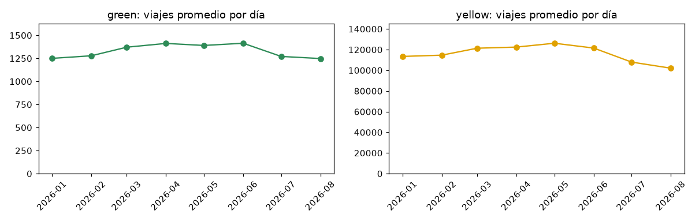
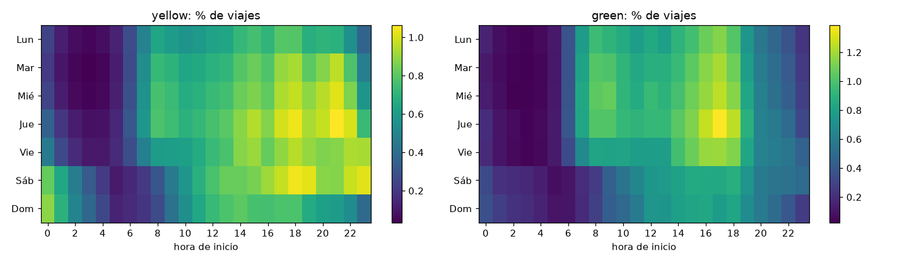
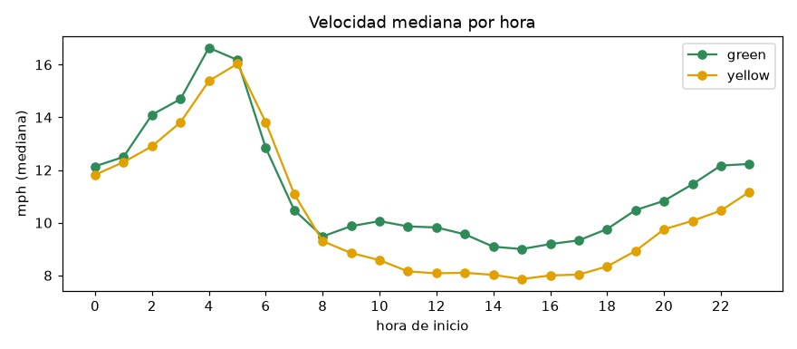
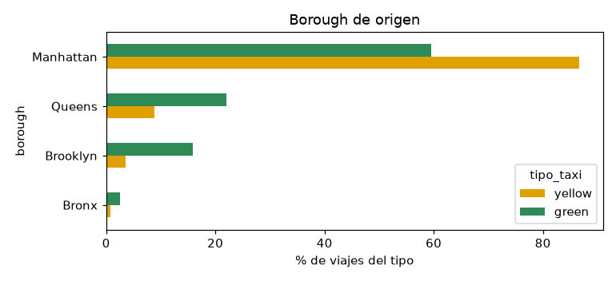
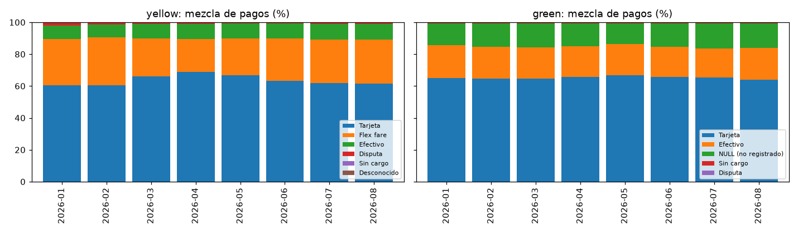
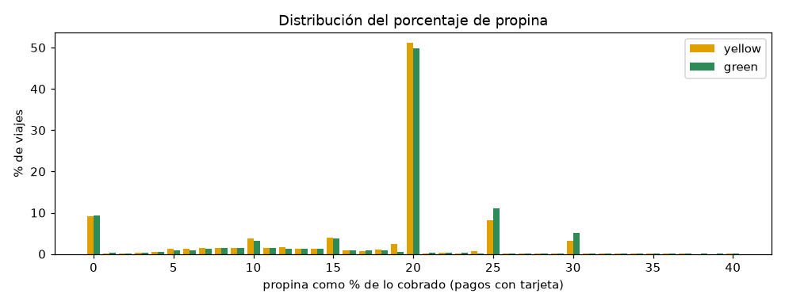
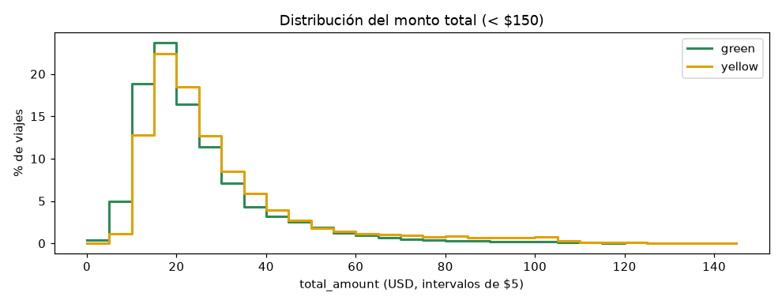

# Ejercicio 4 — Análisis exploratorio utilizando DuckDB

| Elemento | Ubicación |
|---|---|
| Vistas base (unificación yellow/green, limpieza, catálogos) | `sql/00_vistas.sql` |
| Consultas del ejercicio (una por pregunta, marcadas con `-- name:`) | `sql/02_analisis_exploratorio.sql` |
| Ejecución, tablas y gráficas | `notebooks/02_analisis_exploratorio.ipynb` |
| Figuras exportadas | `docs/img/ej4_*.png` |
| Utilidades (conexión + carga de consultas por nombre) | `scripts/lab_db.py` |

**Datos analizados:** 2026, enero–agosto (16 archivos Parquet, 30,040,469 registros). Era todo lo publicado
por la TLC al momento del ejercicio; las consultas no mencionan el año, así que funcionan sin cambios cuando se
agregan más años (ver Ejercicio 5).

## Decisiones de diseño previas

1. **Una vista unificada `viajes`.** Yellow y green tienen nombres distintos para las mismas columnas
   (`tpep_*` y `lpep_*`) y columnas que solo tiene uno de los dos (`Airport_fee` en yellow; `ehail_fee` y
   `trip_type` en green). La vista renombra todo a un esquema común y agrega `tipo_taxi`, así cada pregunta
   se responde con una sola consulta que compara ambos servicios con `GROUP BY tipo_taxi`.
2. **El año y el mes salen del nombre del archivo**, no de la fecha del viaje (`regexp_extract` sobre
   `filename`). En el Ejercicio 3 aparecieron viajes con fechas fuera de 2026, y así se pueden detectar.
3. **La vista `viajes_limpios`** aplica las reglas de limpieza R1–R4 (fecha dentro del periodo del archivo,
   duración entre 0 y 4 h, distancia entre 0 y 100 mi, montos no negativos) y calcula columnas derivadas
   (`duracion_min`, `velocidad_mph`, `hora`, `dia_semana`). Las métricas de comportamiento usan esta vista.
   Los conteos de calidad y de métodos de pago usan `viajes`, sin filtrar.
4. **Las filas con `passenger_count` nulo se conservan**, porque son el 26 % de yellow. P12 muestra que el
   faltante es sistemático, así que borrarlas sesgaría el resto de métricas.
5. **Se usan medianas y percentiles en lugar de promedios**, porque la distancia, la duración y los montos
   tienen colas muy largas (P10).

## 4.1 Preguntas planteadas y su justificación

| # | Pregunta | Eje del enunciado | Por qué es relevante para este dataset |
|---|---|---|---|
| P1 | ¿Cómo evoluciona el volumen mensual de viajes por tipo? | Temporal | Los datos llegan en archivos mensuales; hay que saber si los meses son comparables entre sí. |
| P2 | ¿En qué horas y días se concentra la demanda? | Temporal | Cada registro trae timestamp de inicio y fin; sirve para distinguir el uso de traslado diario del uso de ocio. |
| P3 | ¿Cómo es el viaje típico (distancia, duración, pasajeros, velocidad)? | Características / yellow vs green | Define la línea base contra la que se comparan ambos servicios. |
| P4 | ¿Cómo cambia la velocidad a lo largo del día? | Características | La velocidad (distancia / duración) aproxima la congestión, que afecta tarifa y duración. |
| P5 | ¿Dónde se originan los viajes de cada servicio? | Yellow vs green | Los taxis verdes (*boro taxis*) no pueden recoger pasajeros en el sur de Manhattan ni en los aeropuertos; hay que comprobar si los datos lo reflejan. |
| P6 | ¿Qué peso tienen los viajes de aeropuerto? | Yellow vs green / pago | Los aeropuertos tienen cargos propios (`airport_fee`, tarifa fija JFK) y suelen ser los viajes de mayor monto. |
| P7 | ¿Qué métodos de pago se usan y cómo cambia la mezcla? | Pago | `payment_type` determina si se registra la propina y separa las disputas y anulaciones. |
| P8 | ¿Cómo se comportan las propinas? | Pago / distribución | La propina es la componente más variable del total y solo se registra cuando se paga con tarjeta. |
| P9 | ¿Cómo se compone el total y cuadra con sus partes? | Pago / inconsistencias | En 2025–2026 se agregaron recargos nuevos (`cbd_congestion_fee`); hay que validar cómo los reporta cada proveedor. |
| P10 | ¿Cómo se distribuye el monto total y cuántos atípicos hay? | Distribución / atípicos | El Ejercicio 3 encontró montos y distancias extremos; aquí se cuantifican con un criterio explícito (Tukey). |
| P11 | ¿Cuántos registros elimina cada regla de limpieza? | Inconsistencias | Hace visible el costo de cada decisión de limpieza. |
| P12 | ¿Los nulos de `passenger_count` son aleatorios? | Inconsistencias | Si son sistemáticos, imputarlos sin más (p. ej. con 1) es incorrecto. |

## 4.2–4.4 Consultas, resultados e interpretación

Las consultas completas, con su objetivo y fuente, están en `sql/02_analisis_exploratorio.sql`. Las tablas
siguientes son extractos de la salida del notebook.

### Calidad antes de analizar (P11, P12)

| tipo | registros | R1 fuera de periodo | R2 duración inválida | R3 distancia inválida | R4 monto negativo | excluidos | % |
|---|---:|---:|---:|---:|---:|---:|---:|
| yellow | 29,703,355 | 146 | 380,268 | 953,454 | 161,970 | 1,468,439 | 4.94 |
| green | 337,114 | 98 | 1,453 | 12,284 | 1,025 | 14,130 | 4.19 |

* Las reglas excluyen menos del 5 % en ambos servicios. La que más elimina es la de distancia (R3), sobre todo
  viajes con `trip_distance = 0`.
* **P12:** `passenger_count` es nulo en el **100 %** de los viajes con `payment_type = 0` (*Flex fare*, yellow)
  y con `payment_type` NULL (green), y en **0 %** de los demás. En esos mismos registros también falta
  `ratecode_id`, y todos los viajes del proveedor 6 caen en este grupo. Los nulos vienen de un tipo de
  registro concreto, no de errores al azar.

### P1. Volumen mensual — `p1_viajes_por_mes`

* Yellow tiene entre 102 mil y 126 mil viajes diarios; green, entre 1,250 y 1,410. **El servicio verde
  equivale a ~1.1 % del amarillo.**
* Yellow sube de enero (113 mil/día) a mayo (126 mil/día) y cae en julio y agosto (108 mil y 102 mil/día):
  agosto queda 19 % por debajo del pico de mayo. Green muestra el mismo patrón, pero mucho más leve.
* Como los meses tienen distinta cantidad de días (febrero: 28), las comparaciones se hacen con el promedio
  diario y no con el total mensual.

### P2. Demanda por hora y día — `p2_hora_dia_semana`

* **Green es un servicio de días hábiles:** de lunes a viernes concentra el 76.6 % de sus viajes y el domingo
  apenas el 11.4 %. Su pico es entre las 15:00 y las 18:00, cuando sale la gente del trabajo y la escuela.
* **Yellow tiene un componente nocturno y de fin de semana:** el sábado es su día con más viajes (15.95 %),
  la franja de 20:00 a 23:00 sigue alta y la madrugada del sábado y del domingo (00:00–02:00) se ve
  claramente en el mapa de calor. El 3.2 % de sus viajes empieza entre 00:00 y 01:00, contra 1.5 % en green.

### P3. Viaje típico — `p3_caracteristicas_viaje`

| tipo | viajes (limpios) | mediana distancia (mi) | p90 distancia | mediana duración (min) | mediana velocidad (mph) | prom. pasajeros | mediana total (USD) |
|---|---:|---:|---:|---:|---:|---:|---:|
| yellow | 28,234,916 | 1.93 | 8.70 | 14.1 | 9.3 | 1.25 | 23.58 |
| green | 322,984 | 2.14 | 7.51 | 13.3 | 10.1 | 1.30 | 20.52 |

* El viaje típico de yellow y el de green son parecidos (unas 2 millas, unos 14 minutos, 1 pasajero en el
  82 % de los casos). Yellow tiene la cola larga más pesada (p90 de 8.7 mi, por los aeropuertos).
* Green recorre un poco más de distancia en menos tiempo, porque circula en zonas menos congestionadas que el
  centro de Manhattan. Aun así su total mediano es $3 menor: casi no paga el cargo de congestión CBD (P9).

### P4. Velocidad por hora — `p4_velocidad_por_hora`

* La velocidad mediana de yellow baja de **16 mph a las 05:00** a **7.9 mph a las 15:00**, la mitad. Entre
  las 11:00 y las 18:00 se queda alrededor de 8 mph.
* De madrugada los viajes también son más largos (mediana de 3.7 mi a las 05:00 contra 1.7 mi al mediodía),
  porque a esa hora predominan los viajes de aeropuerto y entre boroughs.

### P5. Origen de los viajes — `p5a_borough_origen`, `p5b_top_zonas_origen`

| borough | yellow % | green % |
|---|---:|---:|
| Manhattan | 86.64 | 59.47 |
| Queens | 8.85 | 22.04 |
| Brooklyn | 3.60 | 15.81 |
| Bronx | 0.77 | 2.49 |

* De las 10 zonas principales de yellow, nueve están en Manhattan (Upper East Side, Midtown, Penn Station,
  Times Square, East Village, etc.). La única fuera es **JFK Airport**, en el tercer lugar (3.98 %).
* En green, **East Harlem North y South suman 39.9 % de todos los viajes**, y el resto de su top 10 está en el
  norte de Manhattan (Morningside Heights, Central Harlem), Queens (Forest Hills, Elmhurst, Jamaica) y
  Brooklyn. Los datos reflejan la regulación: green casi no aparece en el sur de Manhattan.

### P6. Aeropuertos — `p6_aeropuertos`

| tipo | % viajes con origen o destino en aeropuerto | total promedio aeropuerto | total promedio resto |
|---|---:|---:|---:|
| yellow | 8.16 | $77.94 | $26.00 |
| green | 3.34 | $48.40 | $24.59 |

En yellow, los viajes de aeropuerto son 1 de cada 12, pero su ticket promedio es **3 veces** el de un viaje
común, así que pesan mucho más en la recaudación que en el volumen.

### P7. Métodos de pago — `p7_metodo_pago`

* Yellow: tarjeta entre 60 % y 69 %, *Flex fare* (código 0) entre 21 % y 30 %, efectivo entre 8 % y 10 %.
  Las disputas caen de 1.5 % en enero a ~0.6 % desde abril.
* Green: tarjeta ~65 %, efectivo ~19–20 % (el doble que en yellow) y 13–16 % de pagos no registrados (NULL).
* El código 0 no aparece en green, y el NULL no aparece en yellow. Son el mismo fenómeno (P12) codificado
  de forma distinta en cada servicio.

### P8. Propinas — `p8a_propinas_por_metodo`, `p8b_histograma_pct_propina`

| tipo | método | viajes | % con propina | propina promedio |
|---|---|---:|---:|---:|
| yellow | Tarjeta | 18,455,506 | 91.13 | $4.26 |
| yellow | Efectivo | 2,558,843 | 0.01 | $0.00 |
| green | Tarjeta | 211,620 | 91.39 | $3.79 |
| green | Efectivo | 62,591 | 0.00 | $0.00 |

* Las propinas en efectivo no se registran: cualquier análisis de propinas debe limitarse a pagos con tarjeta.
* **La mitad de los pagos con tarjeta deja exactamente 20 %** (51.1 % en yellow, 49.8 % en green). Hay picos
  secundarios en 25 %, 30 %, 15 % y 10 % y valores casi nulos entre ellos. La propina se elige casi siempre
  con los botones sugeridos de la pantalla del taxi, no se calcula a mano.

### P9. Composición y consistencia del total — `p9_composicion_total`, `p9b_inconsistencia_por_proveedor`

| tipo | tarifa | extra | congestión | CBD | aeropuerto | peajes | propina | total | % con cargo CBD |
|---|---:|---:|---:|---:|---:|---:|---:|---:|---:|
| yellow | 21.29 | 1.17 | 1.69 | 0.54 | 0.13 | 0.55 | 2.88 | 30.24 | 72.4 |
| green | 16.76 | 0.83 | 0.78 | 0.06 | 0.00 | 0.30 | 2.60 | 25.39 | 8.5 |

| tipo | proveedor | % inconsistentes | diferencia más frecuente |
|---|---|---:|---:|
| yellow | 1 (Creative Mobile) | 86.2 | −$3.25 |
| yellow | 2 (Curb) | 23.7 | +$2.50 |
| yellow | 6 (Myle) | 100.0 | +$12.20 |
| green | 1 | 96.8 | −$1.00 |
| green | 2 | 1.6 | +$2.75 |

* El 72 % de los viajes yellow paga el cargo de congestión CBD, contra 8.5 % de los green. Esto confirma de
  nuevo que green opera fuera del centro.
* **`total_amount` no siempre es la suma de sus componentes, y el error depende del proveedor:**
  * Proveedor 1: la diferencia más común es −$3.25 = $2.50 (congestión) + $0.75 (CBD). Estos montos aparecen
    a la vez dentro de `extra` y en sus propias columnas, así que sumar todas las columnas los cuenta dos
    veces.
  * Proveedor 2: la diferencia es +$2.50 en registros *Flex fare*, donde `congestion_surcharge` viene NULL
    aunque el recargo sí está incluido en el total.
  * Consecuencia: para analizar recargos no basta con sumar columnas. Hay que tratar cada proveedor por
    separado, o trabajar directamente con `total_amount`.

### P10. Distribución del monto total y atípicos — `p10a_distribucion_total`, `p10b_histograma_total`

| tipo | Q1 | mediana | Q3 | límite Tukey | p99 | máximo | atípicos Tukey | % |
|---|---:|---:|---:|---:|---:|---:|---:|---:|
| yellow | 17.50 | 23.58 | 34.50 | 60.00 | 104.96 | 1,065.72 | 2,403,726 | 8.51 |
| green | 15.12 | 20.52 | 29.70 | 51.57 | 94.75 | 668.80 | 21,331 | 6.60 |

* La distribución tiene sesgo a la derecha, con la moda en $15–20. El 8.5 % de los viajes yellow queda por
  encima del límite de Tukey ($60), pero en su mayoría son viajes de aeropuerto legítimos (P6). **El criterio
  IQR no sirve para marcar errores en este dataset**; es mejor una regla de dominio, como la tarifa por milla.
* 4,523 viajes yellow de más de 1 milla cobran más de $50 por milla. Esos sí son candidatos a error.

## 4.5 Hallazgos relevantes

1. **Los faltantes son sistemáticos, no aleatorios.** `passenger_count` y `ratecode_id` son nulos en el
   100 % de los viajes *Flex fare* (`payment_type = 0` en yellow, NULL en green) y en 0 % del resto, que es
   ~26 % de yellow y ~14 % de green. Imputarlos con la moda inventaría pasajeros en un tipo de viaje concreto.
   Lo correcto es tratarlos como una categoría aparte.
2. **`total_amount` no cuadra con sus componentes por diferencias entre proveedores.** El proveedor 1 incluye
   los recargos de congestión y CBD dentro de `extra` y también en sus columnas propias (86 % de sus viajes
   no cuadra, con −$3.25). El proveedor 2 deja NULL el recargo de congestión en *Flex fare*. Cualquier
   indicador de recargos debe calcularse por proveedor.
3. **Yellow y green son servicios distintos, no dos versiones del mismo.** Green tiene ~1 % del volumen, está
   concentrado en East Harlem (40 % de sus viajes), opera sobre todo en días hábiles y por la tarde, casi no
   paga el cargo CBD y usa el doble de efectivo. Yellow es Manhattan-céntrico, tiene demanda nocturna y de
   fin de semana y depende de los aeropuertos (8 % de los viajes, con un ticket 3 veces mayor).
4. **La propina está anclada en los botones sugeridos:** la mitad de los pagos con tarjeta deja exactamente
   20 %, y las propinas en efectivo no quedan registradas.
5. **La congestión se ve en los datos:** la velocidad mediana de yellow baja de 16 mph de madrugada a menos
   de 8 mph a media tarde.
