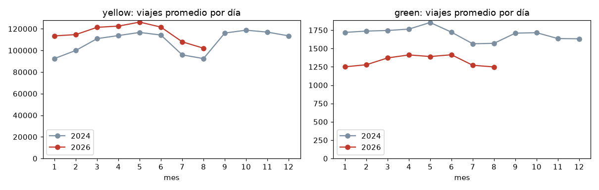

# Ejercicio 5 — Incorporación de datos adicionales (2024)

| Elemento | Ubicación |
|---|---|
| Script de descarga (modificado) | `scripts/download_data.py` |
| Consultas de validación V1–V6 | `sql/03_incorporacion_2024.sql` |
| Ejecución de la validación y de las consultas del Ej. 4 sobre 2024 + 2026 | `notebooks/03_incorporacion_2024.ipynb` |
| Salida de la descarga de 2024 | `docs/evidencia/ej5_descarga_2024.txt` |

## 5.1 Cambios al sistema de descarga

| Antes (Ej. 2) | Ahora (Ej. 5) |
|---|---|
| `ANIO_DEFAULT = 2026` | `ANIOS_DEFAULT = (2024, 2026)` |
| `--year` aceptaba **un** año | `--year` acepta **uno o varios** (`--year 2024 2026`) |
| Un ciclo por tipo de taxi | Un ciclo por año y, dentro de él, por tipo de taxi |
| — | Descarga también `data/raw/taxi_zone_lookup.csv` (catálogo de zonas que usan las vistas), solo si no existe |

No se cambió nada más: la URL, la ruta de destino (`data/raw/<tipo>/<anio>/`), el control de archivos existentes,
la descarga atómica (`.part`) y la validación con `pyarrow` ya estaban parametrizados por año desde el Ejercicio 2.
Para el Ejercicio 8 basta con agregar `2025` a `ANIOS_DEFAULT`.

```bash
docker exec -it lab8-lab python scripts/download_data.py              # 2024 y 2026
docker exec -it lab8-lab python scripts/download_data.py --year 2024  # solo 2024
```

## 5.2–5.4 Ejecución

Resumen de la primera ejecución con los años por defecto (`docs/evidencia/ej5_descarga_2024.txt`):

```text
  Anios          : 2024, 2026
  Descargados    : 24 (676.1 MiB)
  Ya existian    : 16
  No publicados  : 8   (septiembre-diciembre 2026, yellow y green)
  Fallidos       : 0
```

* **5.2:** los 16 archivos de 2026 se conservaron. El script los encontró, validó que fueran Parquet legibles y
  los omitió.
* **5.3:** en una segunda ejecución (celda 2 del notebook 03), el resultado es `Descargados: 0`,
  `Ya existian: 40`. Solo se consulta al servidor (HEAD) por los meses de 2026 que todavía no se publican.

## 5.5 Verificación de los archivos nuevos

**V1 — inventario desde los metadatos Parquet** (`parquet_file_metadata`, que solo lee el pie de cada archivo):

| tipo | año | archivos | meses | registros | MiB |
|---|---:|---:|---|---:|---:|
| yellow | 2024 | 12 | 01–12 | 41,169,720 | 660.9 |
| yellow | 2026 | 8 | 01–08 | 29,703,355 | 487.8 |
| green | 2024 | 12 | 01–12 | 660,218 | 15.2 |
| green | 2026 | 8 | 01–08 | 337,114 | 7.9 |

El conjunto de 2024 está completo: hay 12 meses consecutivos de cada tipo, y la validación con `pyarrow` del
script confirmó que cada archivo se puede leer.

**V2:** el conteo de filas a través de la vista `viajes` coincide **exactamente** con la suma de `num_rows`
de los metadatos para los cuatro grupos (`coincide = true`). La vista no omite archivos ni pierde filas al
combinar esquemas distintos.

**V6:** ningún mes de 2024 está vacío o truncado. Los viajes diarios siguen una serie continua (yellow: entre
92 mil y 119 mil por día; green: entre 1,560 y 1,850).

## 5.6 Consulta conjunta de 2024 y 2026

Las vistas leen `data/raw/<tipo>/*/*.parquet`, así que 2024 quedó incluido sin tocar ninguna consulta. V5 compara
ambos años en una sola consulta, usando los mismos meses (enero–agosto) para que la estacionalidad no afecte la
comparación:

| tipo | año | viajes/día | mediana distancia | mediana duración | mediana total | % tarjeta | % efectivo | % pago no registrado | % cargo CBD |
|---|---:|---:|---:|---:|---:|---:|---:|---:|---:|
| yellow | 2024 | 104,508 | 1.80 mi | 12.7 min | $21.00 | 75.9 | 13.8 | 9.0 | 0.0 |
| yellow | 2026 | 116,193 | 1.93 mi | 14.1 min | $23.58 | 65.4 | 9.1 | 25.0 | 72.4 |
| green | 2024 | 1,709 | 1.96 mi | 11.8 min | $19.14 | 67.8 | 27.7 | 4.0 | 0.0 |
| green | 2026 | 1,329 | 2.14 mi | 13.3 min | $20.52 | 65.5 | 19.4 | 14.8 | 8.5 |



Primeras observaciones. El análisis completo de los tres años es parte del Ejercicio 8.

* Yellow tiene **11 % más viajes diarios** en 2026 que en 2024 (de +6 % a +23 % según el mes). Green tiene
  **22 % menos** (de −18 % a −27 %).
* El cargo de congestión CBD (`cbd_congestion_fee`) no existe en 2024. En 2026 lo paga el 72 % de los viajes
  yellow, y la mediana del total sube de $21.00 a $23.58.
* Los viajes con pago no registrado (*Flex fare*, código 0 en yellow) pasan de 9 % a 25 %, y el efectivo baja
  en ambos servicios.

### Calidad por año (V4)

| tipo | año | fuera de periodo | duración inválida | distancia inválida | monto negativo | % excluido | % passenger_count nulo |
|---|---:|---:|---:|---:|---:|---:|---:|
| yellow | 2024 | 420 | 36,884 | 777,918 | 733,885 | 3.60 | 9.94 |
| yellow | 2026 | 146 | 380,268 | 953,454 | 161,970 | 4.94 | 25.98 |
| green | 2024 | 164 | 3,481 | 34,809 | 2,185 | 5.93 | 3.68 |
| green | 2026 | 98 | 1,453 | 12,284 | 1,025 | 4.19 | 14.47 |

2024 tiene los mismos tipos de problema que 2026, en proporciones parecidas: entre 3.6 % y 5.9 % de
registros excluidos. Por eso las reglas R1–R4 de `viajes_limpios` se mantienen. Dos detalles:

* Yellow 2024 tiene **4.5 veces más montos negativos** (733,885 contra 161,970), aunque tiene muchas menos
  duraciones inválidas.
* Un archivo de 2024 contiene un viaje con fecha **2026-06-26** (`pickup_max`). La regla R1 (fecha dentro del
  periodo del archivo) lo descarta. Esto confirma que conviene tomar el año del nombre del archivo y no de la
  fecha del viaje.

### Evolución del esquema (V3)

| tipo | columna | archivos que la tienen | periodo |
|---|---|---:|---|
| yellow / green | `cbd_congestion_fee` | 8 de 20 | 2026-01 a 2026-08 (no existe en 2024) |
| yellow / green | `request_source` | 3 de 20 | 2026-06 a 2026-08 |

Los tipos físicos de las columnas comunes no cambian entre años. Las diferencias se manejan así:

* `cbd_congestion_fee`: gracias a `union_by_name = true`, las filas de 2024 la traen como NULL. Las consultas ya
  usaban `coalesce(cbd_congestion_fee, 0)`.
* `request_source` (código de la plataforma que envió el viaje, p. ej. `HV0003`) apareció a mitad de 2026. **No se
  agregó a la vista** a propósito: si un subconjunto de archivos no la contiene (por ejemplo, solo enero de
  2026), una vista que la nombre falla al resolver sus columnas. Si un análisis futuro la necesita, se puede leer
  desde `yellow_raw` / `green_raw`.
* Hallazgo colateral: sin `union_by_name`, DuckDB toma el esquema del **primer** archivo del glob. Por eso el
  `DESCRIBE` del Ejercicio 3 (sobre `2026/*.parquet`) mostró 20 columnas en yellow y no vio `request_source`.

## 5.7 ¿Las consultas anteriores deben modificarse?

**No para ejecutarse; sí para interpretarse.** El notebook 03 ejecutó sin cambios las 16 consultas de
`sql/02_analisis_exploratorio.sql` sobre 2024 + 2026. Todas terminaron sin error (la más lenta, P3 con medianas
sobre 72 M de filas, tardó 12 s).

* `p1_viajes_por_mes` y `p7_metodo_pago` ya agrupan por `anio, mes`, así que muestran ambos años por separado
  sin hacer nada más.
* Las otras 14 consultas agregan **todo el periodo disponible** en un solo número por tipo de taxi. Siguen
  siendo correctas, pero ahora describen 2024 + 2026 juntos. Como 2024 y 2026 se comportan distinto (pago,
  cargo CBD, volumen de green), para comparar años basta con agregar `anio` al `SELECT` / `GROUP BY`. Ese
  ajuste corresponde al Ejercicio 8, cuando se integre 2025.
* `sql/01_exploracion_parquet.sql` (Ejercicio 3) tiene rutas fijas a `.../2026/*.parquet`. Sigue funcionando,
  pero solo describe 2026. Se dejó así porque su objetivo era explorar ese año.

## 5.8 Consultas de validación

Todas están documentadas, con su objetivo, en `sql/03_incorporacion_2024.sql`:

| id | Objetivo | Fuente |
|---|---|---|
| V1 `v1_inventario_archivos` | Archivos, meses, filas y tamaño por tipo y año | `parquet_file_metadata('data/raw/*/*/*.parquet')` |
| V2 `v2_conteo_vista_vs_metadatos` | La vista lee todas las filas de todos los archivos | metadatos + vista `viajes` |
| V3 `v3_evolucion_esquema` | Columnas que aparecen o desaparecen y cambios de tipo | `parquet_schema('data/raw/*/*/*.parquet')` |
| V4 `v4_calidad_por_anio` | Las reglas de limpieza siguen siendo válidas para 2024 | vista `viajes` |
| V5 `v5_comparacion_anual_ene_ago` | Consulta conjunta 2024 vs 2026 en el mismo periodo | vista `viajes_limpios` |
| V6 `v6_viajes_por_dia_mes_anio` | Continuidad mensual; ningún archivo vacío o truncado | vista `viajes_limpios` |

## 5.9 Diseño que permite agregar archivos sin rehacer el flujo

1. **Convención de rutas `data/raw/<tipo>/<anio>/<archivo>`.** El año forma parte de la ruta y del nombre, así
   que agregar un año solo agrega carpetas y no cambia nada de lo existente.
2. **Descarga idempotente y parametrizada por año.** El script decide qué hacer según lo que ya hay en disco y
   lo que publica el servidor. Se puede ejecutar cuantas veces se quiera, y un año nuevo es un valor más en
   `ANIOS_DEFAULT`.
3. **Las consultas apuntan a vistas, no a archivos.** Solo `sql/00_vistas.sql` conoce las rutas, y usa globs
   (`*/*.parquet`). Ninguna consulta de análisis menciona rutas ni años.
4. **`union_by_name = true`** tolera cambios de esquema entre años (columnas nuevas como `cbd_congestion_fee`).
5. **`anio`/`mes` derivados del nombre del archivo**, lo que hace robusta la asignación de periodo aunque haya
   timestamps erróneos.
6. **Consultas con nombre en archivos `.sql`, ejecutadas desde notebooks.** La documentación y la ejecución
   usan el mismo texto, así que basta con volver a ejecutar los notebooks para actualizar los resultados.
