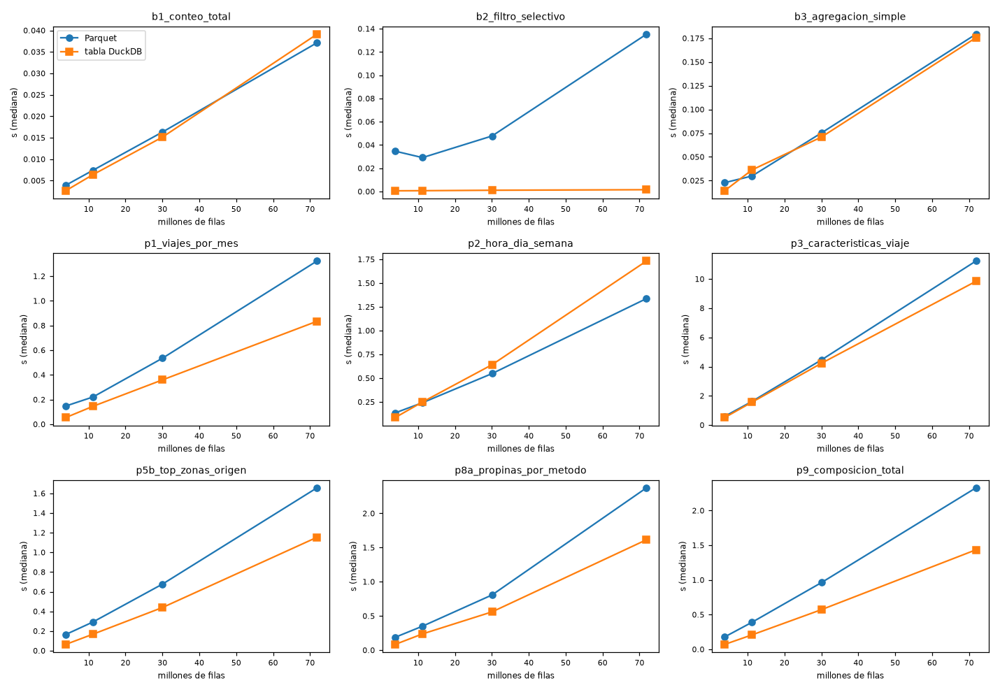

# Ejercicio 6 — Parquet versus tablas DuckDB

| Elemento | Ubicación |
|---|---|
| Materialización de la tabla (6.2) | `scripts/build_duckdb.py` → `data/processed/taxis.duckdb` |
| Script del benchmark | `scripts/benchmark.py` |
| Consultas del benchmark (6.8) | `sql/04_benchmark.sql` (B1–B3) + 6 consultas de `sql/02_analisis_exploratorio.sql` |
| Resultados crudos (una fila por ejecución, Docker) | `docs/benchmark/resultados_benchmark.csv` |
| Escenarios (filas, tamaños, tiempo de carga) | `docs/benchmark/escenarios.csv` |
| Tablas resumen (generadas por el script) | `docs/benchmark/resumen_benchmark.md` |
| Gráfica | `docs/img/ej6_benchmark.png` |
| Salida de la ejecución en Docker (oficial) | `docs/evidencia/ej6_benchmark_salida_docker.txt` |
| Salida de la ejecución local en macOS (comparación) | `docs/evidencia/ej6_benchmark_salida_local_macos.txt` |

## 6.1 / 6.2 Las dos estrategias

**Parquet directo.** Es DuckDB en memoria con las vistas de `sql/00_vistas.sql`. Cada consulta lee los archivos
con `read_parquet()`, y la vista `viajes` hace `UNION ALL` de yellow y green, renombra columnas y obtiene
`anio`/`mes` del nombre del archivo.

**Tabla materializada.** `scripts/build_duckdb.py` ejecuta el mismo `00_vistas.sql` sobre un archivo `.duckdb`
y luego cambia las vistas `viajes` y `zonas` por **tablas con el mismo nombre y las mismas columnas**
(`CREATE TABLE ... AS SELECT * FROM viajes`). `viajes_limpios` sigue siendo una vista, ahora sobre la tabla.

```text
# python scripts/build_duckdb.py          (contenedor lab8-lab)
Base creada: data/processed/taxis.duckdb (1.88 GiB)
  tabla viajes     12.2 s
  tabla zonas       0.0 s
  green  2024  12 meses       660,218 registros
  green  2026   8 meses       337,114 registros
  yellow 2024  12 meses    41,169,720 registros
  yellow 2026   8 meses    29,703,355 registros
```

Como los nombres no cambian, **el texto SQL que se ejecuta es idéntico en ambas estrategias**, y eso es lo que
hace válida la comparación. Además se verificó que los resultados también son idénticos: se ejecutaron B1–B3,
P1, P5b, P9 y P11 en ambas estrategias y los DataFrames salieron iguales.

## 6.3 / 6.8 Consultas del benchmark

Se eligieron para cubrir patrones de acceso distintos, no solo consultas parecidas entre sí:

| id | patrón que representa | origen |
|---|---|---|
| `b1_conteo_total` | Tocar todo el conjunto sin leer columnas (`count(*)`) | `sql/04_benchmark.sql` |
| `b2_filtro_selectivo` | Filtro muy selectivo: JFK, 15-ene-2026, de 17:00 a 18:00 | `sql/04_benchmark.sql` |
| `b3_agregacion_simple` | Barrido de 2 columnas numéricas + `GROUP BY` | `sql/04_benchmark.sql` |
| `p1_viajes_por_mes` | Agregación temporal + `count(DISTINCT)` sobre la vista limpia | Ej. 4, P1 |
| `p2_hora_dia_semana` | Funciones de fecha + función de ventana | Ej. 4, P2 |
| `p3_caracteristicas_viaje` | Medianas y percentiles (cómputo intensivo, ordenamiento) | Ej. 4, P3 |
| `p5b_top_zonas_origen` | `JOIN` con el catálogo de zonas + ventana `QUALIFY` | Ej. 4, P5b |
| `p8a_propinas_por_metodo` | `JOIN` + mediana filtrada | Ej. 4, P8a |
| `p9_composicion_total` | Barrido ancho (13 columnas numéricas) | Ej. 4, P9 |

## 6.4–6.6 Metodología

* **Escenarios de tamaño creciente (6.6).** Cada escenario es un subconjunto de archivos; las dos estrategias
  usan exactamente los mismos archivos. Tiempos de carga medidos en Docker:

  | escenario | archivos | filas | Parquet | `.duckdb` | carga de la tabla |
  |---|---:|---:|---:|---:|---:|
  | 1_mes (ene-2026) | 2 | 3,765,161 | 62 MiB | 102 MiB | 0.9 s |
  | 3_meses (ene–mar 2026) | 6 | 11,199,059 | 185 MiB | 308 MiB | 2.6 s |
  | 2026 (ene–ago) | 16 | 30,040,469 | 496 MiB | 809 MiB | 5.6 s |
  | 2024_2026 | 40 | 71,870,407 | 1,172 MiB | 1,924 MiB | 13.6 s |

* **Medición (6.5).** Cada consulta se ejecuta 1 vez como calentamiento y luego 5 veces. Se reporta la primera
  ejecución y la **mediana** de las 5, medidas con `time.perf_counter()` alrededor de
  `execute(...).fetchall()`, así que el tiempo incluye traer el resultado completo.
* Cada estrategia usa una conexión nueva por escenario. La base temporal se borra al terminar cada escenario
  para no ocupar disco.
* **Ambientes.** Los resultados oficiales son los del **contenedor `lab8-lab`** (DuckDB 1.5.5, Python 3.11.14,
  Linux aarch64, 8 CPUs), con `data/` montado desde macOS como *bind mount*. Como comparación, el mismo script
  se ejecutó directamente en macOS arm64 (16 GB de RAM), en un venv con las mismas versiones fijadas.
* **Nota sobre iCloud.** El repositorio estaba al principio dentro de `~/Documents`, que se sincroniza con
  iCloud. Con el disco casi lleno, macOS desalojó varios Parquet a la nube (quedaron `dataless`) y DuckDB
  fallaba con `IO Error: Operation timed out`. Desde Docker esos archivos ni siquiera se podían leer, y el
  script de descarga los marcaba como corruptos. Se movió el repositorio a `~/dev/`, fuera de iCloud, y desde
  ahí se ejecutó la corrida oficial en Docker. La corrida local se hizo sobre una copia de los datos fuera de
  iCloud.
* Entre la corrida local y la de Docker se agregó `ORDER BY tipo_taxi` a B1 para que su resultado sea
  determinista. El resultado tiene 2 filas, así que el efecto en el tiempo es despreciable.

## 6.7 Resultados (Docker)

Mediana de 5 ejecuciones, en segundos. **Aceleración** = Parquet / tabla (mayor que 1 significa que la tabla es
más rápida). Las tablas completas, con la primera ejecución, están en `docs/benchmark/resumen_benchmark.md`.

| consulta | 1_mes P / T | 3_meses P / T | 2026 P / T | 2024_2026 P / T | aceleración (1 mes → 72 M) |
|---|---|---|---|---|---|
| b1_conteo_total | 0.0039 / 0.0026 | 0.0074 / 0.0064 | 0.0163 / 0.0152 | 0.0371 / 0.0391 | 1.5x → 0.9x |
| b2_filtro_selectivo | 0.0347 / 0.0006 | 0.0292 / 0.0007 | 0.0478 / 0.0011 | 0.1353 / 0.0015 | **57x → 87x** |
| b3_agregacion_simple | 0.0229 / 0.0143 | 0.0299 / 0.0363 | 0.0753 / 0.0710 | 0.1792 / 0.1755 | 1.6x → 1.0x |
| p1_viajes_por_mes | 0.147 / 0.054 | 0.221 / 0.146 | 0.536 / 0.360 | 1.323 / 0.834 | 2.7x → 1.6x |
| p2_hora_dia_semana | 0.134 / 0.085 | 0.242 / 0.249 | 0.548 / 0.642 | 1.337 / 1.732 | 1.6x → **0.8x** |
| p3_caracteristicas_viaje | 0.59 / 0.51 | 1.62 / 1.57 | 4.47 / 4.23 | 11.23 / 9.84 | 1.2x → 1.1x |
| p5b_top_zonas_origen | 0.164 / 0.064 | 0.293 / 0.168 | 0.678 / 0.440 | 1.657 / 1.154 | 2.6x → 1.4x |
| p8a_propinas_por_metodo | 0.188 / 0.084 | 0.351 / 0.238 | 0.808 / 0.560 | 2.373 / 1.614 | 2.2x → 1.5x |
| p9_composicion_total | 0.179 / 0.071 | 0.391 / 0.209 | 0.963 / 0.573 | 2.328 / 1.435 | 2.5x → 1.6x |
| **suma** | **1.47 / 0.89** | **3.18 / 2.62** | **8.14 / 6.90** | **20.60 / 16.83** | **1.7x → 1.2x** |



### Primera ejecución vs mediana con 72 M de filas (Docker)

| consulta | Parquet 1ª / mediana | tabla 1ª / mediana |
|---|---|---|
| p1_viajes_por_mes | 1.37 / 1.32 | **5.06** / 0.83 |
| p3_caracteristicas_viaje | 10.17 / 11.23 | **15.12** / 9.84 |
| b3_agregacion_simple | 0.32 / 0.18 | **0.87** / 0.18 |

### Comparación con la corrida local en macOS (suma de medianas, segundos)

| escenario | Docker Parquet / tabla | macOS Parquet / tabla |
|---|---|---|
| 1_mes | 1.47 / 0.89 (1.7x) | 1.07 / 0.77 (1.4x) |
| 3_meses | 3.18 / 2.62 (1.2x) | 2.66 / 2.36 (1.1x) |
| 2026 | 8.14 / 6.90 (1.2x) | 7.12 / 6.06 (1.2x) |
| 2024_2026 | 20.60 / 16.83 (1.2x) | 16.89 / 16.24 (1.0x) |

## 6.9 Análisis

1. **La tabla es más rápida en general, pero por poco.** Sumando todas las consultas, la tabla es 1.7 veces
   más rápida con 1 mes de datos y 1.2 veces con 72 M de filas. El motor de ejecución es el mismo (vectorizado
   y paralelo); lo único que cambia es la capa de almacenamiento. Con pocos datos pesa el costo fijo de abrir
   archivos, leer pies de página (*footers*) y evaluar la vista. Con muchos datos domina el cómputo, que es
   igual en ambas estrategias.
2. **Los filtros selectivos son donde más gana la tabla: entre 42 y 87 veces.** La tabla responde B2 en
   1–2 ms en todos los escenarios, porque DuckDB guarda estadísticas mín/máx (*zone maps*) por cada grupo de
   unas 122 mil filas y descarta casi todo sin leerlo. Parquet también tiene estadísticas por *row group*,
   pero tiene que abrir cada archivo y leer su metadata, así que su tiempo crece con la cantidad de archivos
   (de 35 ms con 2 archivos a 135 ms con 40), aunque la cantidad de filas que cumplen el filtro no cambie.
3. **Cuando domina el cómputo, el almacenamiento casi no importa.** P3 (medianas y percentiles, que
   requieren ordenar) es la consulta más lenta y la que menos cambia entre estrategias: de 1.0x a 1.2x en
   Docker y prácticamente igual en macOS. Optimizar el almacenamiento no acelera una consulta que no está
   limitada por E/S.
4. **Las consultas anchas y con `JOIN` favorecen a la tabla.** P9 (13 columnas), P8a y P5b mantienen entre
   1.4x y 1.6x incluso con 72 M de filas. Parquet usa compresión de propósito general (Snappy/ZSTD) además de
   su codificación, y descomprimirla en cada consulta cuesta más CPU que las compresiones ligeras de DuckDB
   (diccionario, RLE, *bit-packing*, ALP).
5. **El ambiente cambia la magnitud, no la conclusión.** En Docker, Parquet es entre 14 % y 37 % más lento
   que en macOS: cada consulta vuelve a leer los archivos a través del *bind mount* hacia la VM. La tabla casi
   no cambia (16.8 s contra 16.2 s), porque después de la primera lectura sus bloques quedan en el *buffer
   pool* de DuckDB. Por eso la ventaja de la tabla con 72 M de filas pasa de 1.0x en macOS a 1.2x en Docker:
   **mientras más lenta sea la E/S, más conviene materializar.**
6. **La primera ejecución contra la tabla puede ser lenta.** En Docker, con 72 M de filas, la primera
   ejecución de P1 sobre la tabla tardó 5.06 s y su mediana fue 0.83 s; P3 tardó 15.1 s contra 9.8 s. La
   primera consulta lee los bloques del `.duckdb` desde el disco montado y las siguientes los encuentran en
   memoria. Con Parquet la primera ejecución casi no difiere de la mediana. Si cada consulta se hiciera en un
   proceso nuevo (sin caché), la ventaja de la tabla sería menor.
7. **Hay casos donde Parquet gana con muchos datos.** P2 (funciones de fecha + ventana) es más lenta sobre
   la tabla con 30 M y 72 M de filas, y esto pasó en **los dos ambientes** (0.8x en Docker, 0.7x en macOS),
   así que no parece ruido. B1 queda prácticamente igual (0.9x). No verificamos la causa. Dos hipótesis
   razonables: (a) el lector de Parquet reparte el trabajo por archivo y por *row group*, y con 40 archivos
   logra muy buen paralelismo; (b) el filtro de `viajes_limpios` se aplica dentro del lector Parquet, que
   decodifica solo las columnas que necesita después de filtrar. Para confirmarlo habría que comparar los
   planes con `EXPLAIN ANALYZE`. La conclusión práctica es que **materializar no garantiza mejores tiempos
   para todas las consultas**.
8. **Costo de materializar.** Cargar 72 M de filas tomó 13.6 s en Docker (12.2 s con `build_duckdb.py`), y el
   `.duckdb` ocupa **1.64 veces lo que ocupan los Parquet** (1.9 GiB contra 1.2 GiB) por la compresión más
   ligera. Materializar duplica el almacenamiento, porque los Parquet se siguen necesitando como fuente para
   reconstruir, y hay que volver a cargar cada vez que llegan archivos nuevos.

## 6.10 ¿Cuándo usar cada estrategia?

**Consultar Parquet directamente** conviene cuando:

* los datos **llegan de forma incremental como archivos**, como en este laboratorio. Un archivo nuevo queda
  disponible al instante, sin recargar nada (Ejercicio 5);
* el análisis es **exploratorio o de una sola vez**: no se recupera el costo de cargar (unos 13 s y 1.9 GB
  más) ni el de la primera lectura lenta para unas pocas consultas;
* las consultas son **cómputo intensivo** (percentiles, ordenamientos), donde la diferencia es de 0–20 %
  (P3), o consultas como P2 donde Parquet incluso fue más rápido;
* los mismos archivos los usan **otras herramientas** (pandas, Spark, Polars) o se quiere **una sola copia**
  de los datos;
* el espacio en disco es limitado (Parquet ocupa 40 % menos).

**Materializar una tabla DuckDB** conviene cuando:

* las mismas consultas se ejecutan **muchas veces** en un proceso que se mantiene abierto, como un
  **tablero** (Ejercicio 7 con Metabase). Ahí se recupera el costo de carga y de la primera lectura, y cada
  interacción ahorra tiempo;
* hay **consultas selectivas o interactivas** (filtros por fecha o zona): son de 40 a 90 veces más rápidas
  y responden en milisegundos;
* la **E/S es lenta**: carpetas montadas en Docker, discos de red o almacenamiento remoto (S3/HTTP). Ahí
  leer y descomprimir Parquet en cada consulta pesa más (punto 5);
* se quiere guardar **datos ya limpios o transformados**, para no repetir en cada consulta el `UNION`, el
  renombrado y el `regexp_extract` de la vista;
* se necesitan funciones de base de datos: actualizaciones, transacciones, restricciones, o servir a otra
  herramienta con un solo archivo en modo `read_only`.

**Estrategia recomendada para este proyecto (híbrida):** los Parquet en `data/raw/` son la fuente de verdad y
se consultan directamente durante la exploración. `scripts/build_duckdb.py` construye
`data/processed/taxis.duckdb` como **artefacto derivado y reproducible**, para el tablero y las consultas
repetitivas, y se vuelve a ejecutar cada vez que se descargan archivos nuevos.

## Cómo reproducir

```bash
docker exec -it lab8-lab python scripts/download_data.py      # datos (si aún no existen)
docker exec -it lab8-lab python scripts/build_duckdb.py       # 6.2: tabla materializada
docker exec -it lab8-lab python scripts/benchmark.py          # 6.4–6.7: ~10 min, 4 escenarios x 5 repeticiones
docker exec -it lab8-lab python scripts/benchmark.py --repeticiones 3 --escenarios 1_mes 2026   # versión corta
```

El benchmark sobrescribe `docs/benchmark/*.csv`, `docs/benchmark/resumen_benchmark.md` y
`docs/img/ej6_benchmark.png`. Necesita ~2 GB libres en `data/processed/` para la base temporal del escenario
más grande, y la borra al terminar. No clone el repositorio dentro de una carpeta sincronizada con iCloud.
